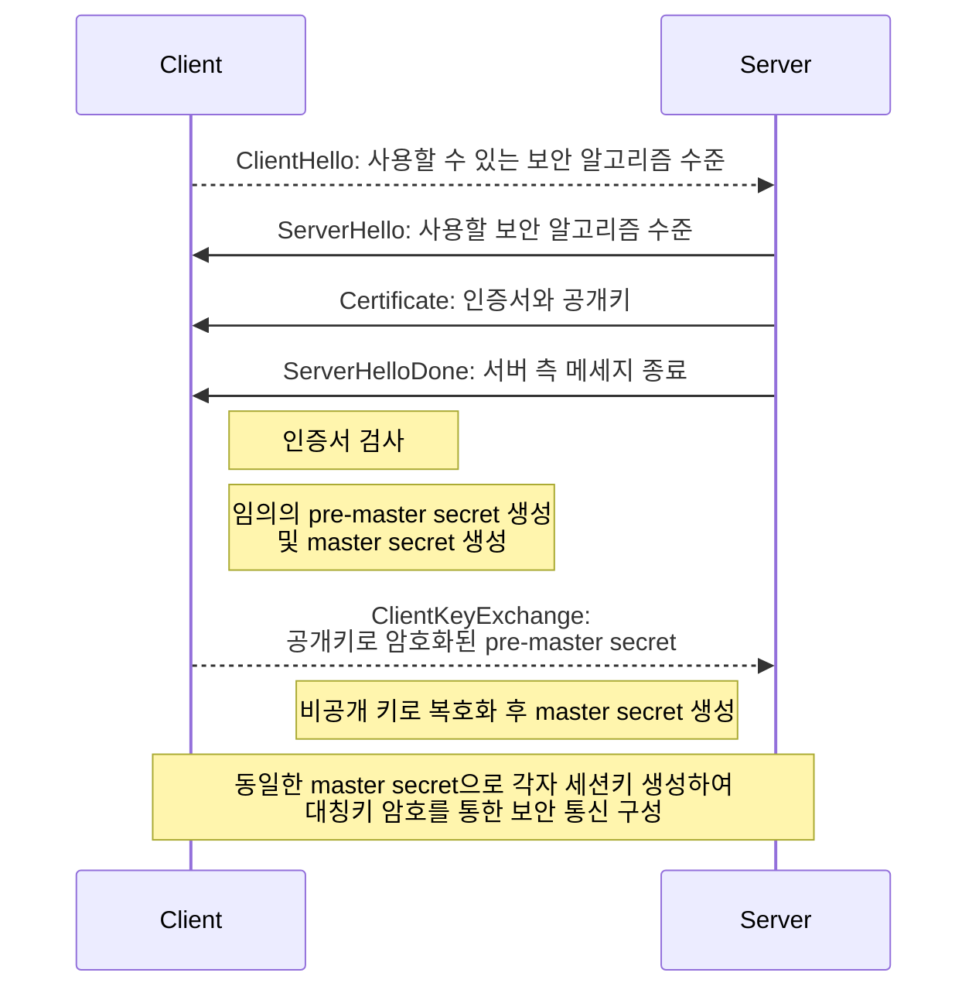

Transport Layer Security
서버와 클라이언트 간에 보안 통신을 구성하는 방식
비대칭키 암호를 통해 키를 주고 받은 뒤, 해당 키를 이용해 대칭키 암호화해 보안 통신을 구성한다.

통신 간 보안을 보장하지만 클라이언트나 서버가 해킹 당했거나 사이트 자체가 가짜 사이트 인 등 노드의 보안은 보장하지 않는다.

```mermaid
sequenceDiagram
  Client-->>Server: ClientHello: 사용할 수 있는 보안 알고리즘 수준
  Server->>Client: ServerHello: 사용할 보안 알고리즘 수준
  Server->>Client: Certificate: 인증서와 공개키
  Server->>Client: ServerHelloDone: 서버 측 메세지 종료
  Note right of Client: 인증서 검사
  Note right of Client: 임의의 pre-master secret 생성<br/>및 master secret 생성
  Client-->>Server: ClientKeyExchange:<br/>공개키로 암호화된 pre-master secret
  Note left of Server: 비공개 키로 복호화 후 master secret 생성
Note over Server,Client: 동일한 master secret으로 각자 세션키 생성하여<br/>대칭키 암호를 통한 보안 통신 구성
```

#용어설명 #보안