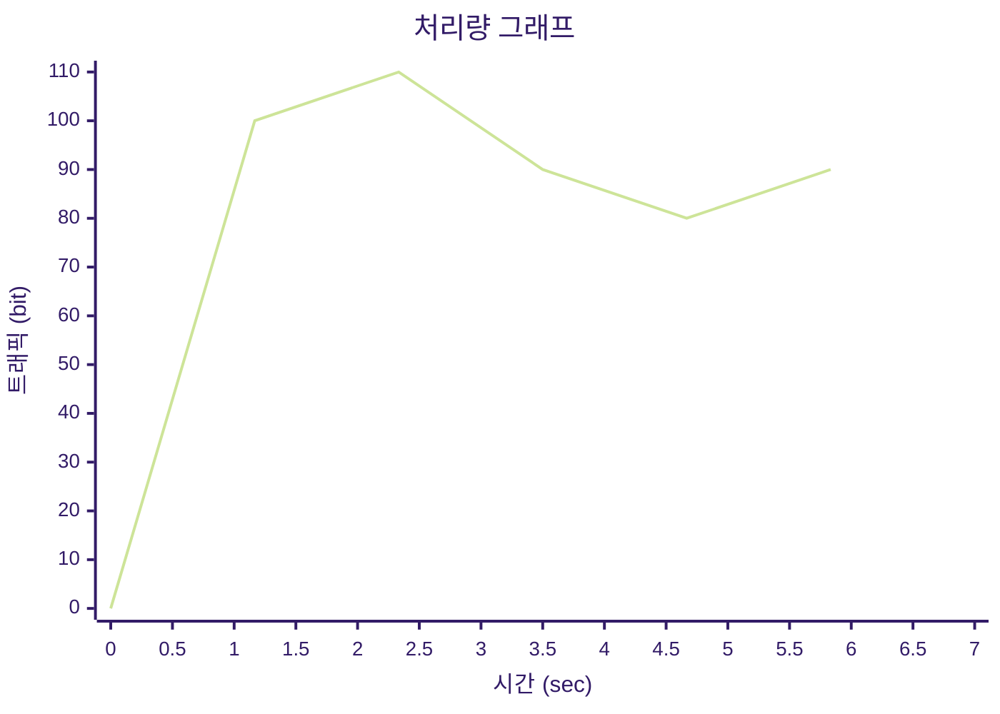

링크를 통해 전달되는 시간당 데이터양
단위: bps(**bit** per second)

```mermaid
%%{init: {'theme':'forest'}}%%
xychart-beta
title "처리량 그래프"
x-axis "시간 (sec)" 0 --> 7
y-axis "트래픽 (bit)"
line "처리량" [0, 100, 110,90,80,90,85]
```