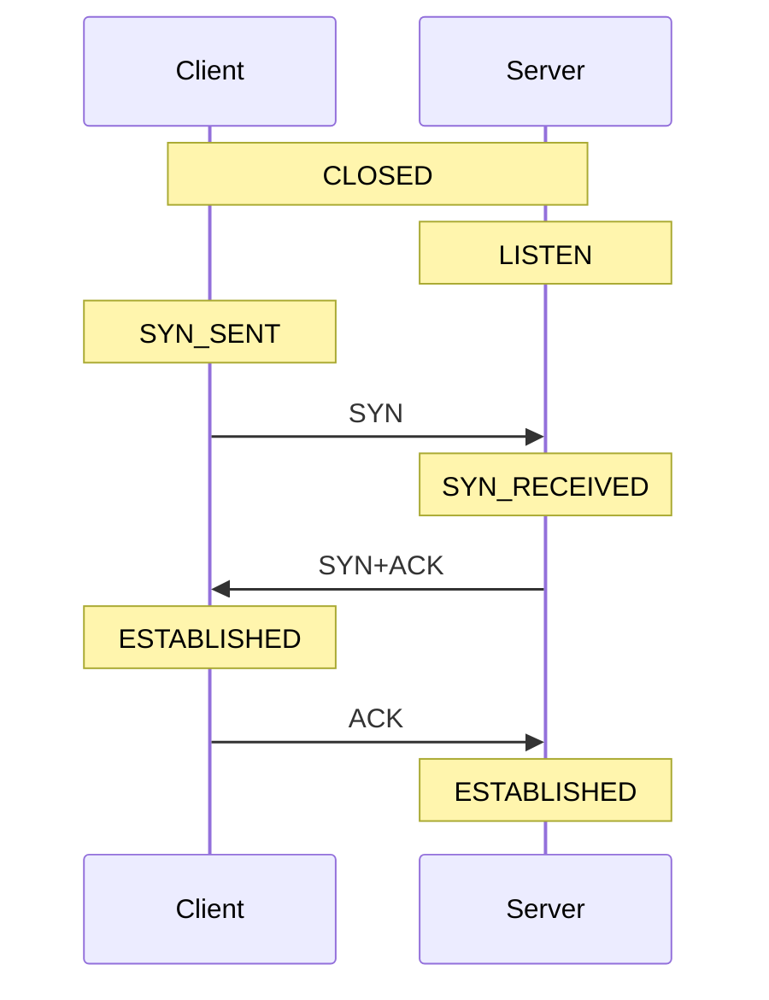

```mermaid
sequenceDiagram
    participant Client
    participant Server
    Note over Client,Server: CLOSED
    Note over Server: LISTEN
    Note over Client: SYN_SENT
    Client->>Server: SYN
    Note over Server: SYN_RECEIVED
    Server->>Client: SYN+ACK
    Note over Client: ESTABLISHED
    Client->>Server: ACK
    Note over Server: ESTABLISHED
```

1. SYN: Client -{ SYN (Client [[ISN]]) }> Server
2. SYN+ACK: Server -{ SYN (Server ISN) + ACK (Client ISN + 1) }> Client
3. ACK: Client -{ ACK (Server ISN + 1) }> Server
