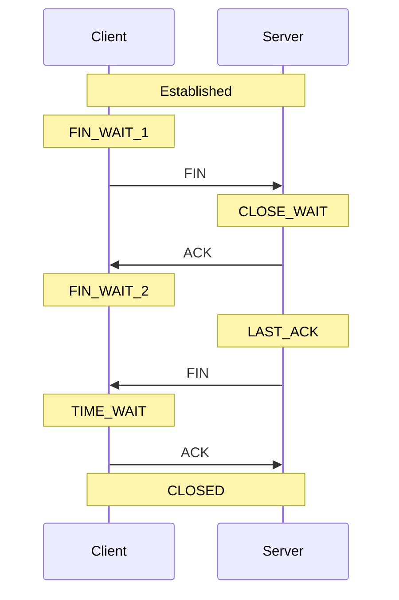

```mermaid
sequenceDiagram
    participant Client
    participant Server
    Note over Client,Server: Established
    Note over Client: FIN_WAIT_1
    Client->>Server: FIN
    Note over Server: CLOSE_WAIT
    Server->>Client: ACK
    Note over Client: FIN_WAIT_2
    Note over Server: LAST_ACK
    Server->>Client: FIN
    Note over Client: TIME_WAIT
    Client->>Server: ACK
    Note over Client,Server: CLOSED
```

1. FIN: Client -{ [[FIN]] }> Server
2. ACK: Server -{ [[ACK]] }> Client
3. FIN: Server -{ FIN }> Client
4. ACK: Client -{ ACK }> Server

[[TIME_WAIT]]

#설명/과정 #네트워크/TCP／IP 
