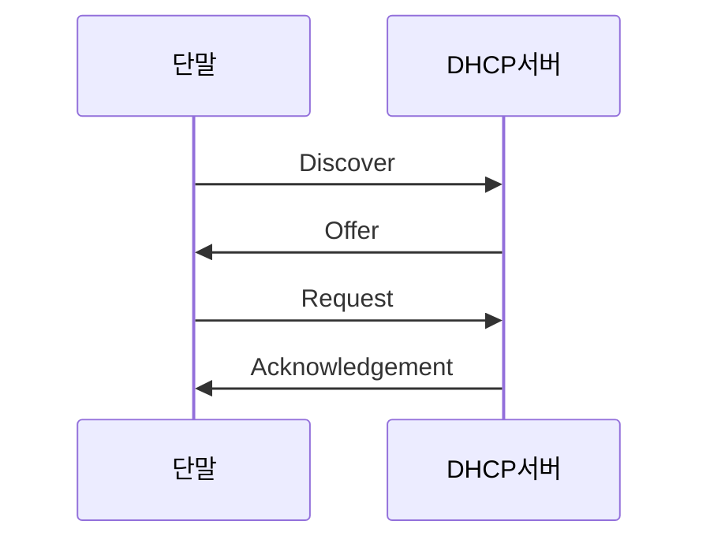

---
aliases:
  - DHCP 임대
---
새로이 망에 연결된 단말이 [[Dynamic Host Configuration Protocol|DHCP]] 서버에게 [[IP Address|IP 주소]]를 요청하고 할당 받는 과정

1. 서버가 단말에게 사용 가능한 [[DHCPDISCOVER|IP 주소 요청]]
2. 서버가 단말에게 IP 주소를 [[DHCPOFFER|제안]]
3. 단말이 제안 받은 [[IP Address|IP 주소]]에 [[Address Resolution Protocol|ARP]]를 시도
	- 응답이 올 경우 이미 사용 중인 IP 주소로 판단하고 [[DHCPDECLINE|거부]]
	- 응답이 없을 경우 사용 가능한 IP 주소로 판단
		1. 단말이 서버에게 IP 주소 할당 [[DHCPREQUEST|요청]]
		2. 단말이 서버에게 요청한 IP 주소가 
			- 사용 불가능한 경우 [[DHCPNAK|비승인]]
			- 사용 가능한 경우 [[DHCPACK|승인]]

#설명/과정 #네트워크/DHCP 