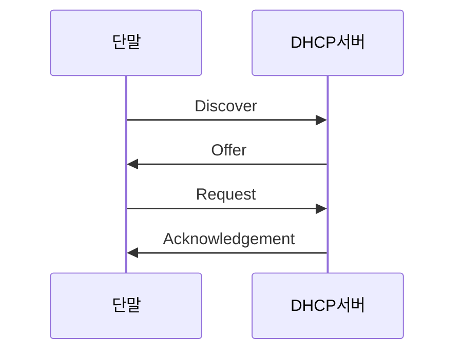
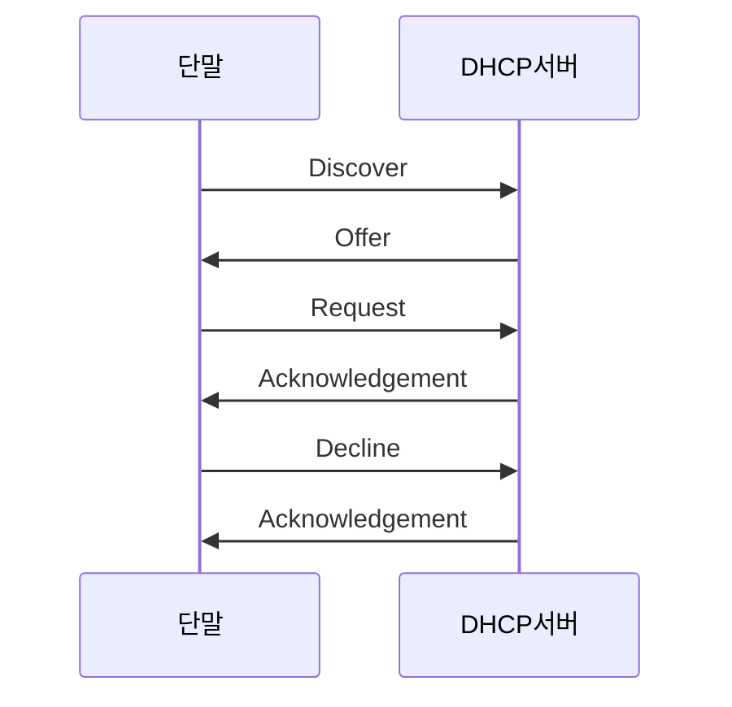

---
aliases:
  - DHCP
  - 동적 호스트 구성 프로토콜
---
[[IP Address|IP 주소]] 및 기타 통신 매개변수 자동 할당 네트워크 관리 [[Protocol|프로토콜]]

여기서 서버란 DHCP를 통해 망 내부 IP 주소를 할당하는 DHCP 서버를 뜻함



[[DHCP Lease|임대]]
- Decline
	- 서버와 임의의 단말이 IP 할당 과정에서 이미 사용하는 IP 주소를 할당하려는 경우, 사용 중이던 단말이 해당 IP 주소가 사용 불가능함을 알리는 내용


```